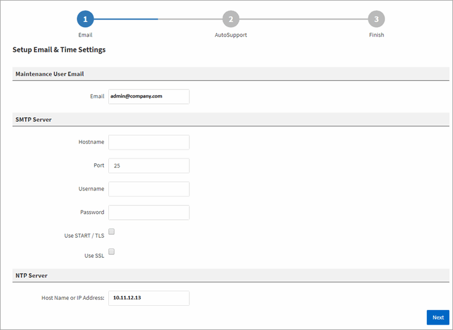

= 執行Unified Manager Web UI的初始設定
:allow-uri-read: 
:icons: font
:imagesdir: ../media/

[role="lead"]
若要使用Unified Manager、您必須先設定初始設定選項、包括NTP伺服器、維護使用者電子郵件地址、以及SMTP伺服器主機名稱和選項。

== 開始之前

您必須執行下列作業：

* 使用安裝後提供的URL啟動Unified Manager Web UI
* 使用安裝期間建立的維護使用者名稱和密碼（適用於Linux安裝的umadmin使用者）登入

== 關於這項工作

僅當您第一次存取Web UI時、才會顯示「The《The NetApp Unified Manager初始設定」頁面OnCommand 。以下頁面來自VMware的安裝。

如果您稍後想要變更其中任何一個選項、可以使用「管理」選項、按一下*即可存取這些選項image:../media/clusterpage-settings-icon.gif[""]*（在Unified Manager工具欄中）。

== 步驟

. 在* OnCommand 《*支援統一化管理程式初始設定*》視窗中、輸入維護使用者電子郵件地址、SMTP伺服器主機名稱及任何其他的SMTP選項、以及NTP伺服器（僅限VMware安裝）。然後單擊*下一步*。
. 在* AutoSupport 《*》*頁面中、按一下*「Agree and Continue *（同意並繼續*）」以啟用AutoSupport 「介紹」。
+
如果您需要指定一個Proxy來提供網際網路存取、以便傳送AutoSupport 支援的內容、或是如果您想停用AutoSupport 「支援」、請使用「管理」選項。

. 在Red Hat和CentOS系統上、您可以選擇將umadmin使用者密碼從預設的「admin」字串變更為個人化字串。

== 結果

「初始設定」視窗隨即關閉、並顯示Unified Manager Web UI。此時會出現「組態/叢集資料來源」頁面、以便您將叢集新增至系統。
