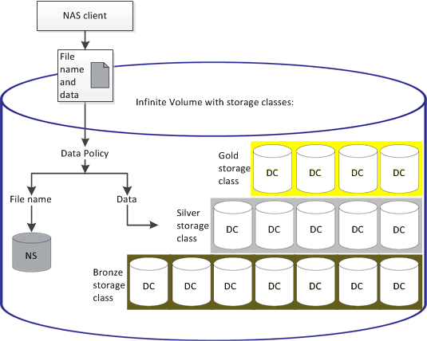

= 資料原則如何篩選寫入無限Volume的資料
:allow-uri-read: 
:icons: font
:imagesdir: ../media/

[role="lead"]
資料原則會自動將寫入Infinite Volume的資料篩選至不同的儲存類別。所有檔案都會寫入Infinite Volume命名空間中的單一檔案系統、而資料原則中的規則會決定儲存檔案資料的儲存類別。

當您建立「無限Volume」（無限Volume）時、會自動為具有「無限Volume」（無限Volume）的儲存虛擬機器（SVM）建立預設資料原則。資料原則為作用中、並包含預設規則。預設規則會儲存檔案的傳入資料、如下所示：「無限磁碟區（含或不含儲存類別）」：

|===
| 對於無限Volume ... | 預設資料原則會執行此動作... 

 a| 
不使用儲存類別
 a| 
將檔案的所有傳入資料放在Infinite Volume中

 a| 
單一儲存類別
 a| 
將檔案的所有傳入資料放入儲存類別

 a| 
一或多個儲存類別
 a| 
將檔案的所有傳入資料放入所建立的第一個儲存類別中

|===
[NOTE]
====
對於具有兩個以上儲存類別的Infinite Volume、您應該盡快修改資料原則、以建立規則、將不同類型檔案的資料篩選至不同的儲存類別。您應該使用Unified Manager來修改資料原則。

====
資料原則不會影響檔案系統中Infinite Volume命名空間中檔案的位置、而且儲存類別對用戶端應用程式而言是透明的。命名空間中的檔案系統包含檔案名稱。資料原則只會影響用來儲存檔案資料的儲存類別。當您將兩個以上的儲存類別指派給無限Volume時、資料原則非常實用。

您可以修改資料原則以建立其他規則、但無法刪除資料原則或其預設規則。

下圖說明資料原則如何篩選無限Volume的資料。檔案名稱儲存在命名空間組成中、而資料原則中的規則則指定此特定檔案的資料儲存在Silver儲存類別中。

