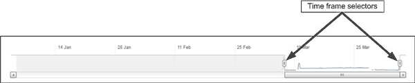
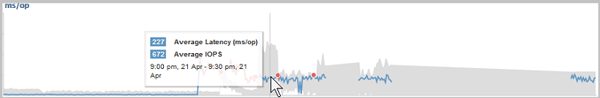

= 效能資料圖表的運作方式
:allow-uri-read: 
:icons: font
:imagesdir: ../media/

[role="lead"]
Unified Manager會使用圖表來顯示指定時間段內的Volume效能統計資料和事件。

圖表可讓您自訂檢視資料的時間範圍。資料會在圖表的橫軸上顯示時間範圍、在垂直軸上顯示計數器、並在圖形線上顯示點間隔。垂直軸為動態軸、值會根據預期或實際值的高峰調整。

== 選擇時間範圍

在「效能/ Volume詳細資料」頁面上、歷史資料圖表可讓您為頁面上的所有圖表選取時間範圍。一維、5d、10d和30d按鈕可指定1天至30天（1個月）、而*自訂*按鈕可讓您指定30天內的自訂時間範圍。圖表上的每個點代表5分鐘的收集時間間隔、並保留最多30天的歷史效能資料。請注意、時間間隔也會導致網路延遲和其他異常狀況。

在此範例中、歷史資料圖表的時間範圍設定為三月開始和結束。在選定的時間範圍內、三月之前的所有歷史資料都會呈現灰色。

== 檢視資料點資訊

若要檢視圖表上的資料點資訊、您可以將游標放在圖表中的特定點上、並會顯示快顯方塊、列出值、日期和時間資訊。

在此範例中、將游標放在「效能/磁碟區詳細資料」頁面上的IOPS圖表上、會顯示上午3：50之間的回應時間和作業值上午3：5510月20日。

== 檢視效能事件資訊

若要檢視圖表上的事件資訊、您可以將游標放在事件圖示上、以在快顯方塊中檢視摘要資訊、或按一下事件圖示以取得更多詳細資訊。

image::../media/opm-bully-volume-png.gif[Performance Manager中的事件快顯視窗]

在此範例中、按一下「延遲」圖表上的事件圖示、即可在快顯方塊中顯示事件的詳細資訊。事件也會在「事件清單」中反白顯示。
