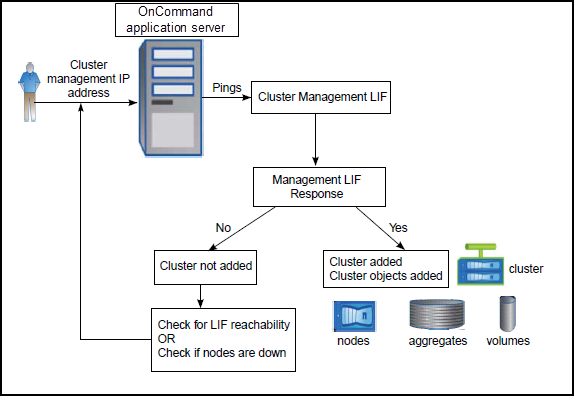

= 叢集探索程序的運作方式
:allow-uri-read: 
:icons: font
:imagesdir: ../media/

[role="lead"]
將叢集新增至Unified Manager之後、伺服器會探索叢集物件並將其新增至其資料庫。瞭解探索程序的運作方式、有助於管理組織的叢集及其物件。

收集叢集組態資訊的監控時間間隔為15分鐘。例如、新增叢集之後、Unified Manager UI中的叢集物件需要15分鐘的時間才能顯示。當對叢集進行變更時、此時間範圍也是如此。例如、如果您將兩個新的磁碟區新增至叢集中的SVM、則會在下一個輪詢時間間隔之後、在UI中看到這些新物件、最多可達15分鐘。

下圖說明探索程序：

在探索新叢集的所有物件之後、Unified Manager會開始收集前15天的歷史效能資料。這些統計資料是使用資料持續性收集功能來收集。此功能可在新增叢集之後、立即為叢集提供超過兩週的效能資訊。在資料持續性收集週期完成之後、系統會依預設每五分鐘收集一次即時叢集效能資料。

[NOTE]
====
由於收集15天的效能資料會佔用大量CPU資源、因此建議您將新增的叢集重新分段、以使資料持續性收集輪詢不會同時在太多叢集上執行。

====