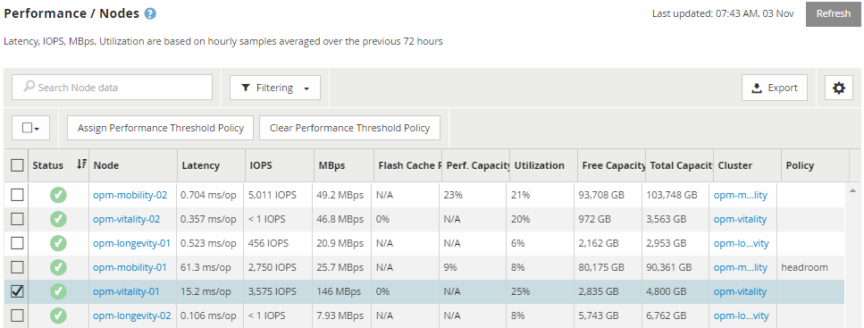

= 使用「效能詳細目錄」頁面監控效能
:allow-uri-read: 
:icons: font
:imagesdir: ../media/

[role="lead"]
物件庫存效能頁面會顯示物件類型類別中所有物件的效能資訊、效能事件及物件健全狀況。這可讓您一覽叢集中每個物件的效能狀態、例如所有節點或所有磁碟區的效能狀態。

物件庫存效能頁面提供物件狀態的高層級總覽、可讓您評估所有物件的整體效能、並比較物件效能資料。您可以透過搜尋、排序及篩選來精簡物件目錄頁面的內容。這在監控和管理物件效能時非常實用、因為它可讓您快速找出有效能問題的物件、並開始疑難排解程序。

根據預設、效能詳細目錄頁面上的物件會根據物件效能關鍵程度來排序。會先列出具有新關鍵效能事件的物件、然後列出具有警告事件的物件。這可立即提供必須解決的問題視覺化指示。所有效能資料均以72小時的平均值為基礎。

按一下物件名稱欄中的物件名稱、即可輕鬆從物件庫存效能頁面導覽至物件詳細資料頁面。例如、在「效能/節點」目錄頁面上、您可以按一下「*節點*」欄中的節點物件。物件詳細資料頁面提供所選物件的深入資訊和詳細資料、包括並排比較作用中事件。
