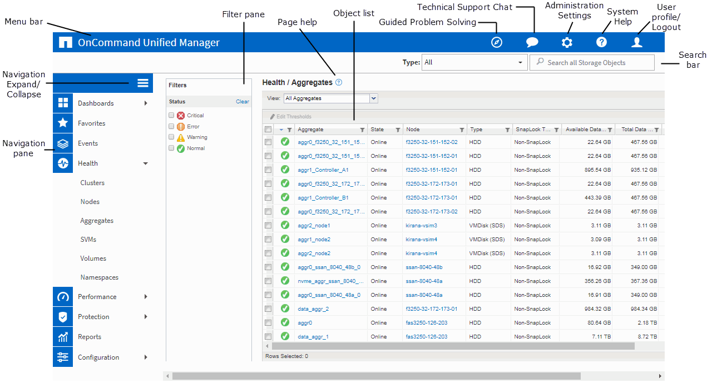

= 典型的視窗配置
:allow-uri-read: 
:icons: font
:imagesdir: ../media/

[role="lead"]
瞭解典型的視窗配置有助於有效瀏覽及使用OnCommand 《The Rsing Unified Manager（《統一化管理程式（The Rsing）：大多數Unified Manager視窗類似於兩種一般配置之一：物件清單或詳細資料。建議的顯示設定至少為1280 x 1024像素。

並非每個視窗都包含下列圖表中的每個元素。

== 物件清單視窗配置

== 物件詳細資料視窗配置

image::../media/object-details.gif[物件詳細資料]
