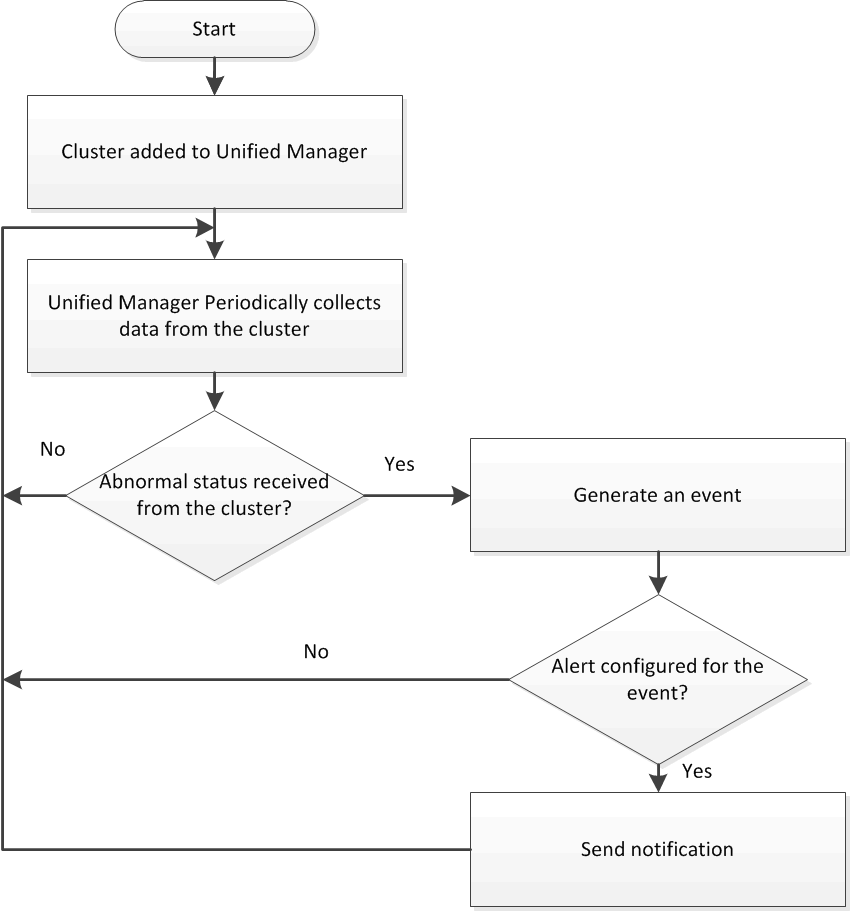

= 瞭解叢集監控
:allow-uri-read: 
:icons: font
:imagesdir: ../media/

[role="lead"]
您可以將叢集新增至Unified Manager資料庫、以監控叢集的可用度、容量及其他詳細資料、例如CPU使用率、介面統計資料、可用磁碟空間、qtree使用量及機箱環境。

當狀態異常或超出預先定義的臨界值時、就會產生事件。如果設定為如此、Unified Manager會在事件觸發警示時、傳送通知給指定的收件者。

下列流程圖說明Unified Manager監控程序：

