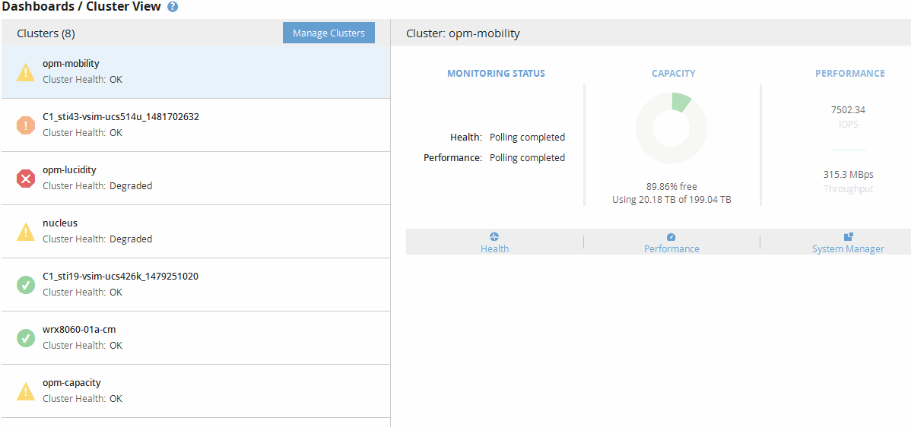

= 瞭解叢集檢視儀表板
:allow-uri-read: 
:icons: font
:imagesdir: ../media/

[role="lead"]
Unified Manager叢集檢視總覽儀表板提供有關所管理叢集健全狀況的高階資訊。叢集檢視儀表板包含兩個主要區段：受管理的叢集（左側）和叢集詳細資料（右側）。

下圖顯示監控八個叢集的Unified ManagerCluster View儀表板範例：

每個叢集名稱旁的狀態圖示可處於下列狀態：

* 重大（image:../media/sev-critical-um60.png["事件嚴重性的圖示–嚴重"]）：已針對叢集報告一或多個作用中的重大事件。
* 錯誤（image:../media/sev-error-um60.png["事件嚴重性圖示–錯誤"]）：已針對叢集報告一或多個作用中錯誤事件。
* 警告（image:../media/sev-warning-um60.png["事件嚴重性圖示–警告"]）：已針對叢集報告一或多個作用中警告事件。
* 正常（image:../media/sev-normal-um60.png["事件嚴重性圖示–正常"]）：未報告叢集的作用中事件。

[NOTE]
====
此色彩表示物件是否存在作用中（新的或已確認的）事件。不再使用的事件（稱為過時事件）不會影響圖示的色彩。

====
若要顯示有關叢集的其他資訊、您可以執行下列其中一項動作：

* 您可以按一下叢集名稱、顯示叢集監控狀態、容量狀態和效能狀態的總覽資訊。
* 您可以按一下「*管理叢集*」以顯示「組態/叢集資料來源」頁面、您可在此頁面中檢視Unified Manager執行個體所管理之所有叢集的詳細狀態資訊。

