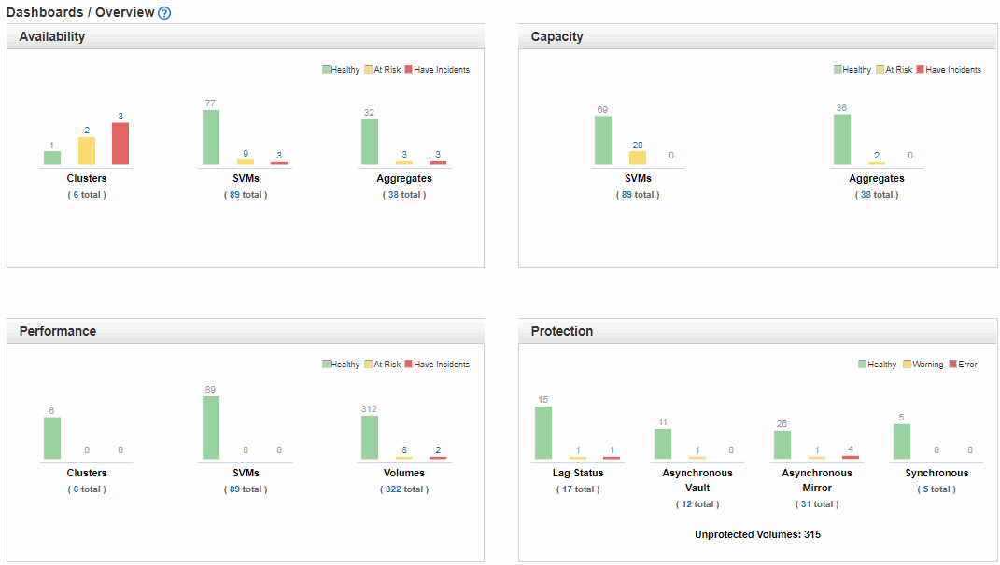

= 瞭解健全狀況總覽儀表板
:allow-uri-read: 
:icons: font
:imagesdir: ../media/

[role="lead"]
Unified Manager健全狀況總覽儀表板提供有關儲存設備和虛擬化環境健全狀況的累積性概覽資訊。「儀表板/總覽」頁面提供儲存物件的健全狀況資訊、這些物件分為四種健全狀況類別：儲存物件的可用度、容量、效能和保護。

下圖說明儀表板/總覽頁面上顯示的窗格：

== 健全狀況總覽區域

以圖表形式顯示有關叢集、集合體及儲存虛擬機器（SVM）等儲存物件健全狀況、以及保護關係健全狀況的資訊。「儀表板/總覽」頁面會顯示針對下列類別所產生的事件：

按一下任一黃色或紅色橫條圖上方的數字、即會顯示「事件」目錄頁面、其中僅包括這些事件。按一下任一圖表下方的數字、即可顯示物件詳細目錄頁面、其中僅包含這些物件。

* *可用度*
+
顯示Unified Manager所監控之叢集、SVM及集合體的可用度資訊。根據所產生的可用性相關事件、儲存物件會分類為健全、有風險或有事件。

* *容量*
+
顯示Unified Manager監控的SVM和Aggregate容量資訊。根據所產生的容量相關事件、儲存物件會分類為健全、有風險或有事件。

* *效能*
+
顯示有關由Unified Manager監控之叢集、SVM和磁碟區效能的資訊。根據所產生的效能相關事件、儲存物件會分類為健全、有風險或有事件。

* *保護*
+
顯示Unified Manager所監控之保護關係的相關資訊。根據所產生的保護相關事件、保護關係會分類為健全、警告或錯誤。

