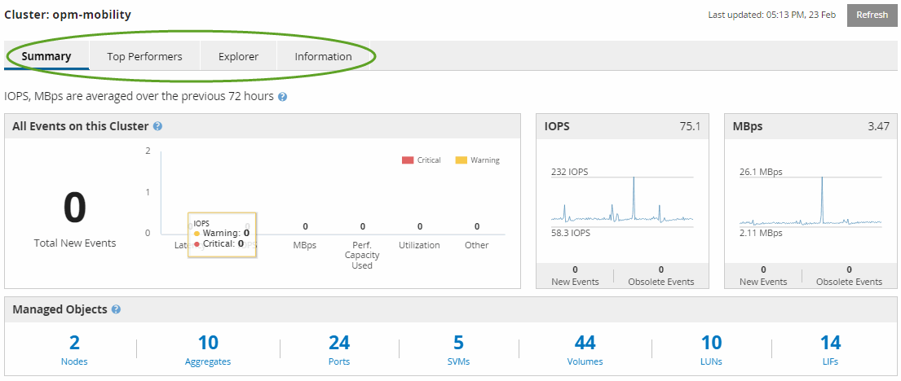

= 瞭解效能叢集登陸頁面
:allow-uri-read: 
:icons: font
:imagesdir: ../media/

[role="lead"]
「效能叢集登陸」頁面提供所選叢集的高層效能總覽、並強調叢集內前10大物件的效能狀態。效能問題會顯示在此頁面頂端的「All Event on this Cluster（此叢集上的所有事件）」面板中。

「效能叢集登陸」頁面提供Unified Manager執行個體所管理之每個叢集的高層級總覽。本頁提供事件與效能的相關資訊、可讓您監控叢集並進行疑難排解。下圖顯示叢集「OPM-MO行動 性」的「效能叢集登陸」頁面範例：

「叢集摘要」頁面上的事件數可能與「效能事件詳細目錄」頁面上的事件數不符。這是因為當違反組合臨界值原則時、「叢集摘要」頁面會在「延遲」和「使用率列」中各顯示一個事件、而「效能事件詳細目錄」頁面則只會在違反組合原則時顯示一個事件。

[NOTE]
====
如果某個叢集已從Unified Manager管理中移除、則狀態*移除*會顯示在頁面頂端叢集名稱的右側。

====