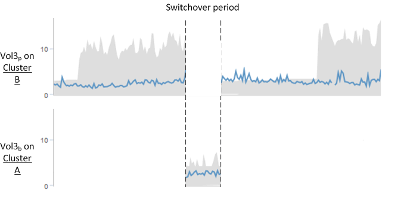

= 切換和切換期間的Volume行為
:allow-uri-read: 
:icons: font
:imagesdir: ../media/

[role="lead"]
觸發切換或切換的事件會導致作用中磁碟區從一個叢集移至災難恢復群組中的另一個叢集。叢集上作用中的磁碟區會停止、並將資料提供給用戶端、其他叢集上的磁碟區也會啟動、並開始提供資料。Unified Manager只會監控作用中和執行中的磁碟區。

由於磁碟區會從一個叢集移至另一個叢集、因此建議您同時監控這兩個叢集。Unified Manager的單一執行個體可監控MetroCluster 整個叢集、但有時兩個位置之間的距離需要使用兩個Unified Manager執行個體來監控兩個叢集。下圖顯示Unified Manager的單一執行個體：

image::../media/opm-mcc-switchover.gif[OPM MCC切換]

名稱為p的磁碟區表示主要磁碟區、名稱為b的磁碟區則是SnapMirror所建立的鏡射備份磁碟區。

正常操作期間：

* 叢集A有兩個作用中磁碟區：Vol1p和Vol2p。
* 叢集B有兩個作用中磁碟區：Vol3p和Vol4p。
* 叢集A有兩個非作用中磁碟區：Vol3b和Vol4b。
* 叢集B有兩個非作用中磁碟區：Vol1b和Vol2b。

Unified Manager會收集每個作用中磁碟區（統計資料、事件等）的相關資訊。Vol1p和Vol2p統計資料是由叢集A收集、而Vol3p和Vol4p統計資料則由叢集B收集

災難性故障導致從叢集B切換至叢集A的作用中磁碟區：

* 叢集A有四個作用中磁碟區：Vol1p、Vol2p、Vol3b和Vol4b。
* 叢集B有四個非作用中磁碟區：Vol3p、Vol4p、Vol1b和Vol2b。

如同正常作業期間、Unified Manager會收集每個作用中磁碟區的相關資訊。但在此案例中、Vol1p和Vol2p統計資料會由叢集A收集、而Vol3b和Vol4b統計資料也會由叢集A收集

請注意、Vol3p和Vol3b並非相同的磁碟區、因為它們位於不同的叢集上。Unified Manager for Vol3p中的資訊與Vol3b不同：

* 切換至叢集A期間、Vol3p統計資料和事件不會顯示。
* 在第一次切換時、Vol3b看起來像是一個新的磁碟區、沒有歷史資訊。

當叢集B修復並執行切換時、Vol3p會在叢集B上再次作用、並顯示切換期間的歷史統計資料和統計資料落差。在發生另一次切換之前、無法從叢集A檢視Vol3b：

[NOTE]
====
* 不活動的現象磁碟區（例如、切換後叢集A上的Vol3b）會以「此Volume Is Deleted」（此磁碟區已刪除）訊息加以識別。MetroClusterVolume並未實際刪除、但Unified Manager目前並未監控、因為它不是作用中Volume。
* 如果單一Unified Manager正在MetroCluster 監控二個叢集的功能、則Volume搜尋會傳回當時作用中磁碟區的資訊。例如、搜尋「'Vol3'」會在發生切換且Vol3已在叢集A上啟用時、傳回叢集A上Vol3b的統計資料和事件

====