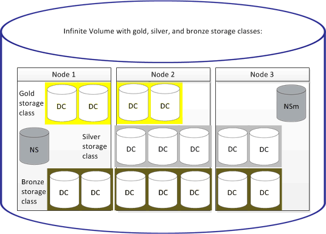

= 什麼是儲存類別
:allow-uri-read: 
:icons: font
:imagesdir: ../media/

[role="lead"]
儲存類別是集合體特性和Volume設定的定義。您可以定義不同的儲存類別、並將一或多個儲存類別與無限Volume建立關聯。您必須使用OnCommand Workflow Automation 支援功能來定義儲存類別需求的工作流程、並將儲存類別指派給Infinite Volumes。

您可以定義儲存類別的下列特性：

* Aggregate特性、例如要使用的磁碟類型
* 磁碟區設定、例如壓縮、重複資料刪除和磁碟區保證

例如、您可以定義僅使用含SAS磁碟之集合體的儲存類別、以及下列磁碟區設定：啟用壓縮與重複資料刪除的精簡配置。

下圖說明一個橫跨多個節點的Infinite Volume、並使用下列儲存類別：Gold、Silver和Bronze。每個儲存類別可跨越無限Volume內的兩個或多個節點。此圖也說明資料成分在每個儲存類別中的位置。

