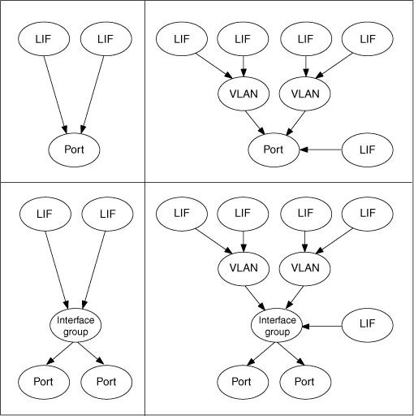

= 生命是什麼
:allow-uri-read: 
:icons: font
:imagesdir: ../media/

[role="lead"]
LIF（邏輯介面）是具有相關特性的IP位址或WWPN、例如角色、主連接埠、主節點、容錯移轉至的連接埠清單、以及防火牆原則。您可以在叢集透過網路傳送和接收通訊的連接埠上設定LIF。

LIF可裝載於下列連接埠：

* 不屬於介面群組的實體連接埠
* 介面群組
* VLAN
* 裝載VLAN的實體連接埠或介面群組
* 虛擬IP（VIP）連接埠
+
從推出支援VIP LIF的ONTAP 功能開始、VIP LIF就會在VIP連接埠上提供支援。

在LIF上設定FC等SAN傳輸協定時、它會與WWPN相關聯。

http://docs.netapp.com/ontap-9/topic/com.netapp.doc.dot-cm-sanag/home.html["《SAN管理指南》（英文）ONTAP"]

下圖說明ONTAP 了一個作業系統中的連接埠階層架構：

