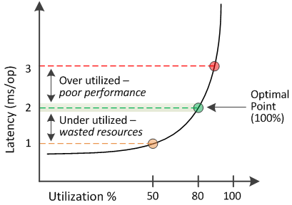

= 效能容量所使用的價值代表什麼意義
:allow-uri-read: 
:icons: font
:imagesdir: ../media/

[role="lead"]
效能使用容量值可協助您識別目前過度使用或未充分利用的節點和集合體。這可讓您重新分配工作負載、以提高儲存資源的效率。

下圖顯示資源的延遲與使用率曲線、並以彩色點識別目前作業點所在的三個區域。

* 效能使用量百分比等於100、是處於最佳狀態。
+
目前正在有效率地使用資源。

* 效能使用量百分比超過100表示節點或Aggregate使用率過高、而且工作負載的效能不佳。
+
不應在資源中新增任何工作負載、而且可能需要重新分配現有的工作負載。

* 效能使用量百分比低於100表示節點或Aggregate未充分利用、且資源未有效使用。
+
可以將更多工作負載新增至資源。

[NOTE]
====
與使用率不同、效能使用量百分比可能超過100%。沒有最大百分比、但資源過度使用時、通常會處於110%到140%的範圍內。百分比越高、表示資源有嚴重問題。

====