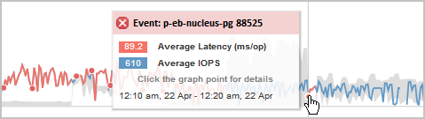

= 效能事件分析與通知
:allow-uri-read: 
:icons: font
:imagesdir: ../media/

[role="lead"]
效能事件會通知您叢集元件爭用所造成的磁碟區工作負載I/O效能問題。Unified Manager會分析事件、找出所有相關工作負載、爭用元件、以及事件是否仍是您可能需要解決的問題。

Unified Manager會監控叢集上磁碟區的I/O延遲（回應時間）和IOPS（作業）。例如、當其他工作負載過度使用叢集元件時、元件會發生爭用、無法在最佳層級執行以滿足工作負載需求。使用相同元件的其他工作負載效能可能會受到影響、導致延遲增加。如果延遲超過效能臨界值、Unified Manager會觸發效能事件並傳送電子郵件警示通知您。

== 事件分析

Unified Manager會使用前15天的效能統計資料、執行下列分析、以識別事件中所涉及的受害者工作負載、高效能工作負載及叢集元件：

* 識別延遲已超過效能臨界值（即預期範圍的上限）的受害者工作負載：
+
** 對於HDD或Flash Pool（混合式）Aggregate上的磁碟區、只有在延遲大於5毫秒（毫秒）且IOPS每秒操作超過10次（作業/秒）時、才會觸發事件。
** 對於All SSD Aggregate或FabricPool Fes供（複合）Aggregate上的磁碟區、只有在延遲大於1毫秒且IOPS超過100次作業/秒時、才會觸發事件

* 識別爭用中的叢集元件。
+
[NOTE]
====
如果叢集互連的受害工作負載延遲大於1毫秒、Unified Manager會將此視為重大問題、並觸發叢集互連的事件。

====
* 識別過度使用叢集元件並導致其爭用的高層工作負載。
* 根據工作負載在叢集元件使用率或活動方面的差異、對所涉及的工作負載進行排名、以判斷哪些基礎架構在叢集元件的使用率上有最高的變更、以及哪些受害者受影響最大。

事件可能只發生一小段時間、然後在使用的元件不再發生爭用時自行修正。持續事件是指在五分鐘間隔內、針對同一個叢集元件再次發生、並保持作用中狀態的事件。對於持續事件、Unified Manager會在連續兩個分析時間間隔內偵測到相同事件後觸發警示。仍未解決且狀態為新的事件、會在事件變更所涉及的工作負載時顯示不同的說明訊息。

事件解決後、仍可在Unified Manager中使用、以記錄某個磁碟區過去的效能問題。每個事件都有一個唯一的ID、可識別事件類型、以及涉及的磁碟區、叢集和叢集元件。

[NOTE]
====
單一磁碟區可同時參與多個事件。

====

== 事件狀態

事件可能處於下列其中一種狀態：

* *主動*
+
表示效能事件目前為作用中（新增或已確認）。導致事件的問題本身並未修正、或尚未解決。儲存物件的效能計數器仍高於效能臨界值。

* *過時*
+
表示事件不再處於作用中狀態。導致事件的問題已自行修正或已解決。儲存物件的效能計數器不再超過效能臨界值。

== 事件通知

事件警示會顯示在「儀表板/總覽」頁面、「儀表板/效能」頁面、「效能/ Volume詳細資料」頁面、並傳送至指定的電子郵件地址。您可以在「事件詳細資料」頁面上檢視事件的詳細分析資訊、並取得解決建議。

在此範例中、事件會以紅點（image:../media/opm-incident-icon-png.gif["Performance Manager事件圖示"]）的「效能/磁碟區詳細資料」頁面上的「延遲」圖表。將滑鼠游標移到紅點上方、會顯示快顯視窗、其中包含事件的詳細資料、以及用於分析的選項。

== 事件互動

在「效能/磁碟區詳細資料」頁面上、您可以使用下列方式與事件互動：

* 將指標移到紅點上會顯示一則訊息、顯示事件ID、以及延遲、每秒作業次數、以及偵測到事件的日期和時間。
+
如果同一時間段有多個事件、則訊息會顯示事件數目、以及磁碟區的平均延遲和每秒作業量。

* 按一下單一事件會顯示一個對話方塊、顯示事件的詳細資訊、包括相關的叢集元件、類似於「事件詳細資料」頁面上的「摘要」區段。
+
爭用中的元件會圈選並反白顯示為紅色。您可以按一下事件ID或*檢視完整分析*、在「事件詳細資料」頁面上檢視完整分析。如果同一時間段有多個事件、對話方塊會顯示最近三個事件的詳細資料。您可以按一下事件ID、在「事件詳細資料」頁面上檢視事件分析。如果同一時間段內有三個以上的事件、按一下紅點不會顯示對話方塊。

