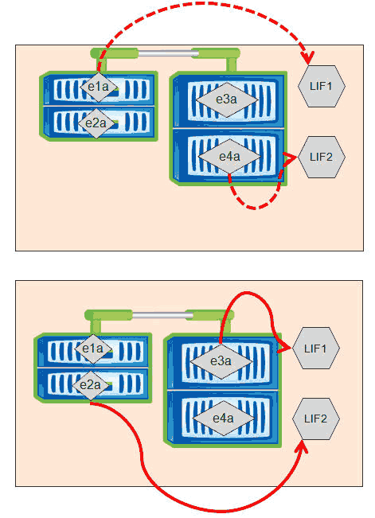
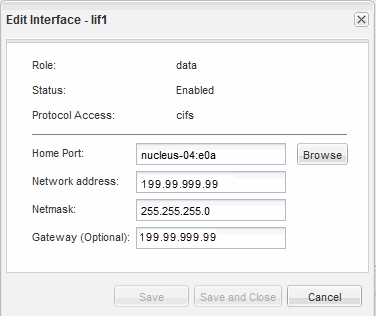

= 使用OnCommand 《支援系統管理程式》變更LIF的主連接埠和節點
:allow-uri-read: 
:icons: font
:imagesdir: ../media/

[role="lead"]
您可以修改LIF的主連接埠和主節點、以變更其偏好的位置。這是比移轉LIF更持久的組態、而LIF通常用於在排程維護期間、將LIF暫時重新定位至不同的節點。

== 關於這項工作

下圖顯示原始LIF主連接埠和節點、以及變更後的主連接埠和節點。最初的LIF1主連接埠從e1a改為e3a、而LIF2則從E4A改為E2A。

== 步驟

. 開放OnCommand 式系統管理程式。
. 在* Home-*（主頁*）選項卡中，雙擊儲存系統。
. 在導覽窗格中、展開* SVMS*階層架構。
. 在導覽窗格中、選取SVM、然後按一下*組態*>*網路介面*。
. 選取LIF並按一下*編輯*。
. 在「**編輯介面*」對話方塊中、輸入目標連接埠的主連接埠和網路位址。
+

+
[NOTE]
====
在本例中、主連接埠欄位已停用ONTAP 。

====
. 按一下*儲存並關閉*。

