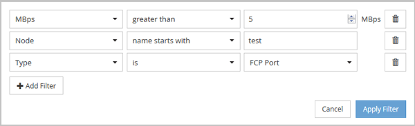

= 篩選「物件庫存管理效能」頁面中的資料
:allow-uri-read: 
:icons: font
:imagesdir: ../media/

[role="lead"]
您可以篩選「物件庫存管理效能」頁面中的資料、以便根據特定條件快速找到資料。您可以使用篩選功能來縮小「物件庫存管理效能」頁面的內容、只顯示您指定的結果。這是一種非常有效率的方法、只顯示您感興趣的效能資料。

== 關於這項工作

您可以使用「篩選」面板、根據偏好自訂網格檢視。可用的篩選選項是根據在網格中檢視的關聯物件類型而定。如果目前套用篩選、篩選控制項左側會顯示星號（*）。

支援四種類型的篩選參數。

|===
| 參數 | 驗證 

 a| 
字串（文字）
 a| 
運算子為* contain*、*開頭為*。

 a| 
數量
 a| 
運算子*大於*且*小於*。

 a| 
資源
 a| 
運算子為*名稱contain*、*名稱開頭為*。

 a| 
狀態
 a| 
運算子為* is *、* is not *。

|===
每個篩選器都需要全部三個欄位；可用的篩選器會反映目前頁面上可篩選的欄位。您可以套用的篩選數目上限為四個。篩選的結果是以合併的篩選參數為基礎。篩選的結果會套用至篩選搜尋中的所有頁面、而不只是目前顯示的頁面。

您可以使用「篩選」面板新增篩選條件。

. 在頁面頂端、按一下*篩選*。畫面會顯示篩選面板。
. 在「篩選」面板中、按一下左下拉式清單、然後選取物件名稱：例如、_Cluster_或效能計數器。
. 按一下中心下拉式清單、然後選取布林運算子*名稱contain*或*名稱開頭為*（如果第一個選取項目是物件名稱）。如果第一個選擇是效能計數器、請選取*大於*或*小於*。如果第一個選擇是*狀態*、請選取*是*或*不是*。
. 如果您的搜尋條件需要數值、右欄位中會顯示向上和向下箭頭按鈕。您可以按一下向上和向下箭頭按鈕、以顯示所需的數值。
. 如有需要、請在右側的文字欄位中輸入您的非數字搜尋條件。
. 若要新增篩選條件、請按一下*新增篩選條件*。此時會顯示額外的篩選欄位。請使用上述步驟中所述的程序來完成此篩選器。請注意、新增第四個篩選器後、*新增篩選器*按鈕將不再顯示。
. 按一下「*套用篩選條件*」。篩選選項會套用至網格、而「篩選」按鈕會顯示星號（*）。
. 按一下要移除之篩選右側的垃圾桶圖示、即可使用「篩選」面板移除個別篩選。
. 若要移除所有篩選條件、請按一下篩選面板底部的*重設*。

== 篩選範例

下圖顯示篩選面板包含三個篩選器。當您的篩選器數量少於最多四個時、就會顯示*新增篩選器*按鈕。

按一下「*套用篩選條件*」之後、「篩選」面板會關閉並套用您的篩選條件。

image::../media/opm-filters-applied.gif[已套用OPM篩選器]
