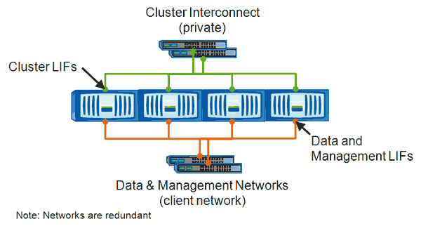

= 手動移動LIF
:allow-uri-read: 
:icons: font
:imagesdir: ../media/

[role="lead"]
儲存虛擬機器（SVM）包含資料磁碟區和一個或多個邏輯介面（LIF）、SVM可透過這些介面向用戶端提供資料。您可以在同一個SVM內、將資料生命體從一個實體連接埠移至另一個連接埠。您可能想要改善負載平衡、或是協助維護作業和效能調校。

== 關於這項工作

存在下列類型的生命生命：

* 資料生命量：與SVM相關聯、用於與用戶端通訊。
* 叢集管理生命區：用於管理節點、SVM及叢集本身。
* 叢集lifs：用於叢集內流量。
* 叢集間LIF：用於叢集之間的通訊。
* 叢集內lifs：用於HA配對之間的通訊。
* SVM管理生命區：與SVM相關聯的資料生命區、用於管理該SVM。

此工作流程說明如何移動資料生命期。這適用於NAS（NFS和CIFS）生命期、但不適用於SAN（FC和iSCSI）生命期。

[NOTE]
====
移動連線至CIFS共用的LIF時、存取CIFS共用的用戶端將會中斷連線。任何對CIFS共用區的讀取或寫入要求都會中斷。

====
[NOTE]
====
如需如何搬移其他類型的生命設備的詳細資訊、包括移動連接的生命設備CIFS共享區的詳細資訊、請參閱ONTAP 《The》（英文）《The》（英文）《The》（英文）《The》（英文）。

====
您可以執行下列與資料生命期相關的基本動作：

* 顯示所有資料生命量。
* 找出最忙碌的生命。
* 找出接受使用中LIF的最佳節點。
* 修改LIF的主連接埠或節點、以變更其在叢集中的偏好位置。
+
您應該搬移LIF、而非移轉LIF、以便進行更持久的變更。若要返回原始的主連接埠、您應該還原LIF。

* 將資料LIF移轉至其他連接埠、以便在主連接埠或節點發生問題或正在進行排程維護時、暫時變更資料。
* 將資料LIF還原至其主連接埠。

