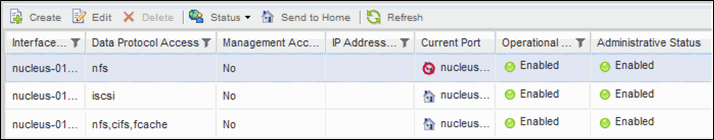

= 使用OnCommand S還原 系統管理程式將LIF還原至其主連接埠
:allow-uri-read: 
:icons: font
:imagesdir: ../media/

[role="lead"]
您可以在LIF容錯移轉或手動或自動移轉至不同的連接埠之後、將其從目前的連接埠還原至主連接埠。您可以使用OnCommand 「系統管理程式」來執行此作業。

== 關於這項工作

建立LIF時、系統管理員會指定一個主連接埠和主節點作為LIF的慣用位置。如果主節點無法使用、或主連接埠發生實體連結中斷、則LIF會自動移轉至新位置。例如OnCommand 、更新位置會在《支援系統管理程式》中報告為LIF的目前連接埠。除非啟用自動還原選項、否則LIF將會保留在此新位置、直到還原為止。

== 步驟

. 開放OnCommand 式系統管理程式。
. 在* Home-*（主頁*）選項卡中，雙擊儲存系統。
. 在導覽窗格中、展開*儲存虛擬機器*階層架構。
. 在導覽窗格中、選取SVM、然後按一下*組態*>*網路介面*。
. 在*目前連接埠*欄中尋找顯示紅色十字標記的房屋圖示的資料生命週期、如下圖所示。
+

. 選取LIF並按一下*傳送至首頁*。
+
只有當所選介面裝載於非主連接埠、且主連接埠可用時、才會啟用此選項。

