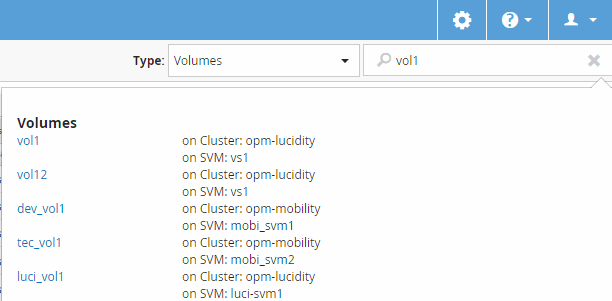

= 正在搜尋儲存物件
:allow-uri-read: 
:icons: font
:imagesdir: ../media/

[role="lead"]
若要快速存取特定物件、您可以使用介面右上角的*搜尋所有儲存物件*欄位。這種跨所有物件進行全域搜尋的方法、可讓您依類型快速找到特定物件。搜尋結果會依儲存物件類型排序、您可以使用*類型*下拉式功能表、根據物件進一步篩選。

== 開始之前

* 您必須具備下列任一角色才能執行此工作：操作員、OnCommand 資訊管理員或儲存管理員。
* 有效搜尋必須包含至少三個字元。

== 關於這項工作

使用「類型」下拉式功能表值「所有」時、全域搜尋會顯示所有物件類別中的結果總數、每個物件類別最多可搜尋25個結果。您可以從「類型」下拉式功能表中選取特定物件類型、以精簡特定物件類型的搜尋。在此情況下、傳回的清單不限於前25個物件。

您可以搜尋的物件類型包括：

* 叢集
* 節點
* SVM
* 集合體
* 磁碟區
* qtree
* CIFS共用
* 使用者或群組配額
* LUN
* NVMe命名空間
* 啟動器群組
* 啟動器

您可以按一下搜尋結果中的任何物件、瀏覽至該物件的「健全狀況」詳細資料頁面。如果物件沒有直接健全狀況頁面、則會顯示父物件的健全狀況頁面。例如、搜尋特定LUN時、會顯示LUN所在的SVM詳細資料頁面。

[NOTE]
====
連接埠無法在全域搜尋列中搜尋。

====

== 步驟

. 從*類型*功能表中選取物件類型、以精簡僅適用於單一物件類型的搜尋結果。
. 在「*搜尋所有儲存物件*」欄位中、輸入至少三個字元的物件名稱。
+
在此範例中、「*類型*」下拉式方塊已選取「Volume」物件類型。在「*搜尋所有儲存物件*」欄位中輸入「'vol1'」、會顯示名稱包含這些字元的所有磁碟區清單。

+

