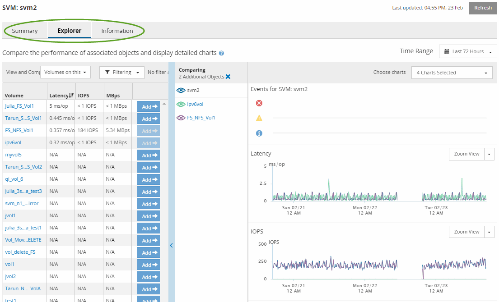

= 物件登陸頁面的元件
:allow-uri-read: 
:icons: font
:imagesdir: ../media/

[role="lead"]
「物件登陸」頁面提供所有重大、警告和資訊事件的詳細資料。它們提供所有叢集物件效能的詳細檢視、可讓您在不同的時間週期中選取及比較個別物件。

「物件登陸」頁面可讓您檢查所有物件的整體效能、並以並排格式比較物件效能資料。在評估效能和疑難排解事件時、這項功能非常實用。

[NOTE]
====
計數器摘要面板和計數器圖表中顯示的資料是以五分鐘的取樣時間間隔為基礎。頁面左側物件庫存網格中顯示的資料是以一小時的取樣時間間隔為基礎。

====
下圖顯示物件登陸頁的範例、其中顯示檔案總管資訊：

視所檢視的儲存物件而定、「物件登陸」頁面可能會有下列索引標籤、提供有關物件的效能資料：

* 摘要
+
顯示三或四個計數器圖表、其中包含前72小時期間每個物件的事件和效能、包括顯示該期間高值和低值的趨勢線。

* 檔案總管
+
顯示與目前物件相關的儲存物件網格、可讓您將目前物件的效能值與相關物件的效能值進行比較。此索引標籤包含最多11個計數器圖表和時間範圍選取器、可讓您執行各種比較。

* 資訊
+
顯示儲存物件的非效能組態屬性值、包括安裝的ONTAP 版本的VMware軟體、HA合作夥伴名稱、連接埠和LIF的數量。

* 頂尖表現者
+
對於叢集：根據您選取的效能計數器、顯示效能最高或效能最低的儲存物件。

* 容錯移轉規劃
+
對於節點：顯示當節點的HA合作夥伴故障時、對節點效能影響的預估值。

* 詳細資料
+
適用於Volume：顯示所選Volume工作負載之所有I/O活動與作業的詳細效能統計資料。此索引標籤可用於FlexVol 「資料集」、FlexGroup 「資料集」和「FlexGroups」的組成。

