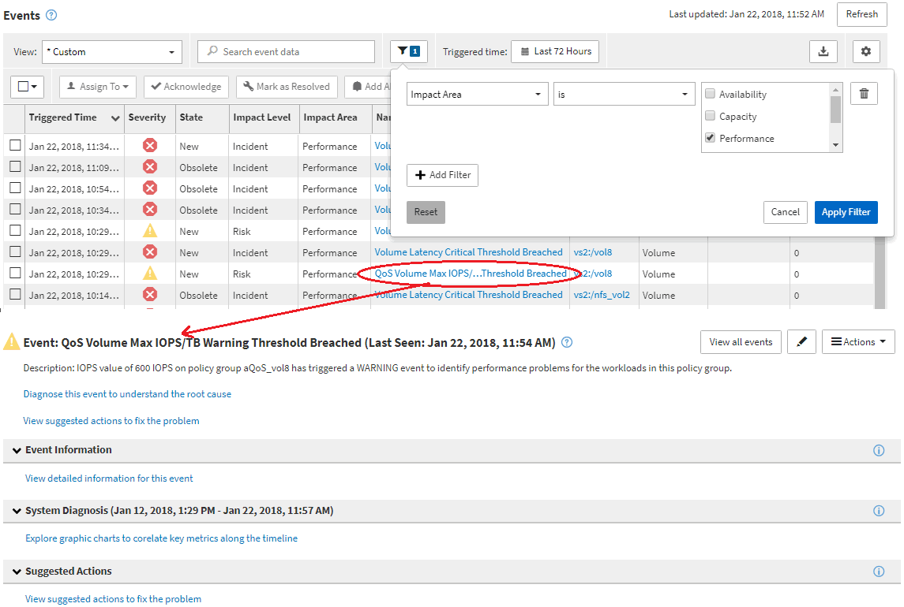

= 事件調查導覽
:allow-uri-read: 
:icons: font
:imagesdir: ../media/

[role="lead"]
Unified Manager事件詳細資料頁面可讓您深入瞭解任何效能事件。這在調查效能事件、疑難排解、以及微調系統效能時、都很有幫助。

視效能事件類型而定、您可能會看到兩種事件詳細資料頁面之一：

* 使用者定義和系統定義臨界值原則事件的事件詳細資料頁面
* 動態臨界值原則事件的事件詳細資料頁面

這是事件調查導覽的範例之一。

. 在左導覽窗格中、按一下*事件*。
. 在「事件」目錄頁面中、按一下篩選按鈕、然後在「影響」區域中選取「*效能*」、以篩選事件清單。
. 按一下您要調查的事件名稱、就會顯示「事件詳細資料」頁面。
. 展開任何領域、例如「建議行動」、以檢視更多有關事件的詳細資料、協助您解決問題。

