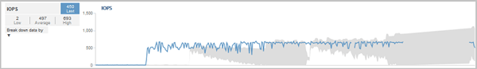

= 叢集作業如何影響工作負載延遲
:allow-uri-read: 
:icons: font
:imagesdir: ../media/

[role="lead"]
作業（IOPS）代表叢集上所有使用者定義和系統定義工作負載的活動。IOPS統計資料可協助您判斷叢集處理程序（例如進行備份或執行重複資料刪除）是否會影響工作負載延遲（回應時間）、或可能導致或促成效能事件。

分析效能事件時、您可以使用IOPS統計資料來判斷效能事件是否是由叢集上的問題所造成。您可以找出可能是效能事件主要促成因素的特定工作負載活動。IOPS的測量單位為每秒作業數（作業/秒）。

此範例顯示「效能/磁碟區詳細資料」頁面上的IOPS圖表。實際作業統計資料為藍色線、預期作業統計資料範圍為灰色。

[NOTE]
====
在叢集過載的某些情況下、Unified Manager可能會顯示訊息 `Data collection is taking too long on Cluster cluster_name`。這表示Unified Manager收集的統計資料不足、無法進行分析。您需要減少叢集所使用的資源、以便收集統計資料。

====