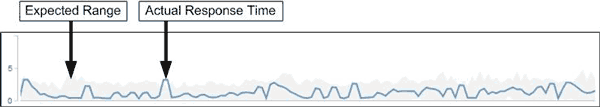

= Unified Manager如何使用工作負載延遲來識別效能問題
:allow-uri-read: 
:icons: font
:imagesdir: ../media/

[role="lead"]
工作負載延遲（回應時間）是叢集上的磁碟區回應用戶端應用程式I/O要求所需的時間。Unified Manager會使用延遲來偵測並警示效能事件。

高延遲意味著從應用程式到叢集上某個磁碟區的要求所需時間比平常長。由於一或多個叢集元件發生爭用、造成高延遲的原因可能出在叢集本身。高延遲也可能是由叢集外部的問題所造成、例如網路瓶頸、裝載應用程式的用戶端問題、或是應用程式本身的問題。

[NOTE]
====
Unified Manager只會監控叢集上的工作負載活動。它不會監控應用程式、用戶端或應用程式與叢集之間的路徑。

====
叢集上的作業（例如進行備份或執行重複資料刪除）、會增加其他工作負載共享叢集元件的需求、也會造成高延遲。如果實際延遲超過預期範圍的效能臨界值、Unified Manager會分析事件、判斷是否為您可能需要解決的效能事件。延遲以毫秒為單位、以每次作業（毫秒/秒）為單位。

在「效能/磁碟區詳細資料」頁面上、您可以檢視延遲統計資料的分析、瞭解個別程序（例如讀取和寫入要求）的活動與整體延遲統計資料的比較結果。這項比較可協助您判斷哪些作業的活動量最高、或是特定作業是否有異常活動會影響磁碟區的延遲。分析效能事件時、您可以使用延遲統計資料來判斷事件是否是由叢集上的問題所造成。您也可以識別事件所涉及的特定工作負載活動或叢集元件。

此範例顯示「效能/磁碟區詳細資料」頁面上的「延遲」圖表。實際回應時間（延遲）活動為藍線、預期範圍為灰色。

[NOTE]
====
如果Unified Manager無法收集資料、藍線可能會有落差。這可能是因為叢集或磁碟區無法連線、Unified Manager在此期間關閉、或收集所需時間超過5分鐘。

====