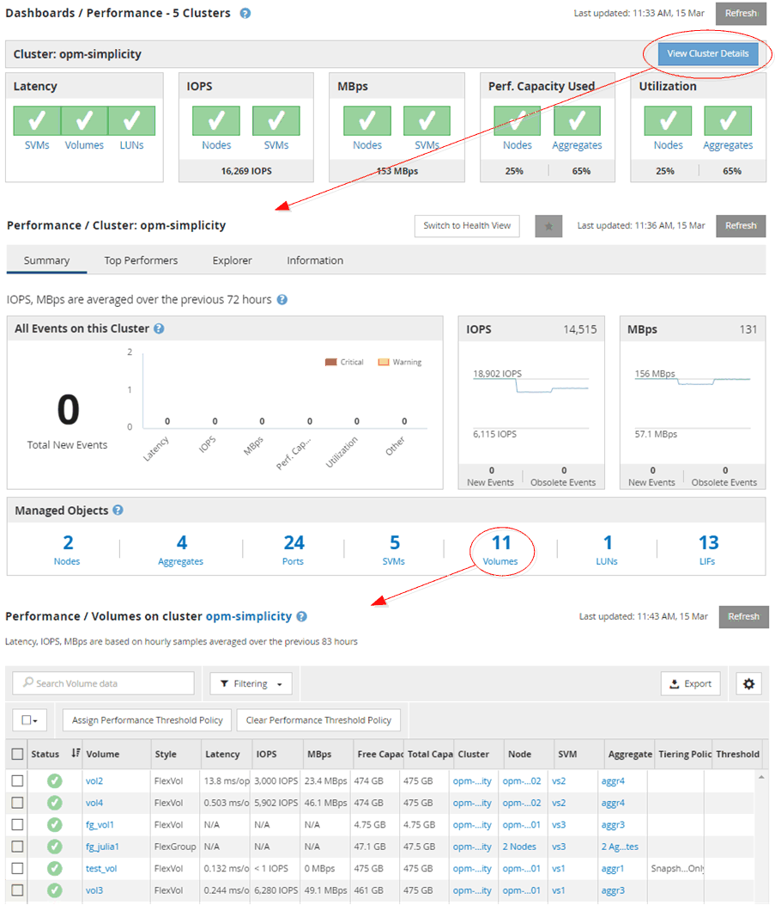

= 監控叢集物件導覽
:allow-uri-read: 
:icons: font
:imagesdir: ../media/

[role="lead"]
Unified Manager可讓您監控Unified Manager所管理之任何叢集中所有物件的效能。監控儲存物件可提供叢集與物件效能的總覽、包括效能事件監控。您可以在高層級檢視效能和事件、也可以進一步調查任何物件效能和效能事件的詳細資料。

以下是許多可能的叢集物件導覽範例之一：

. 從「儀表板/效能」頁面、找出您要調查的叢集、然後瀏覽至所選叢集的登陸頁面。
. 在「效能/叢集摘要」頁面中、找出您要調查的叢集物件、然後瀏覽至該物件的詳細目錄頁面。在此範例中、* Volumes *會選取以顯示「效能/磁碟區」目錄頁面。

