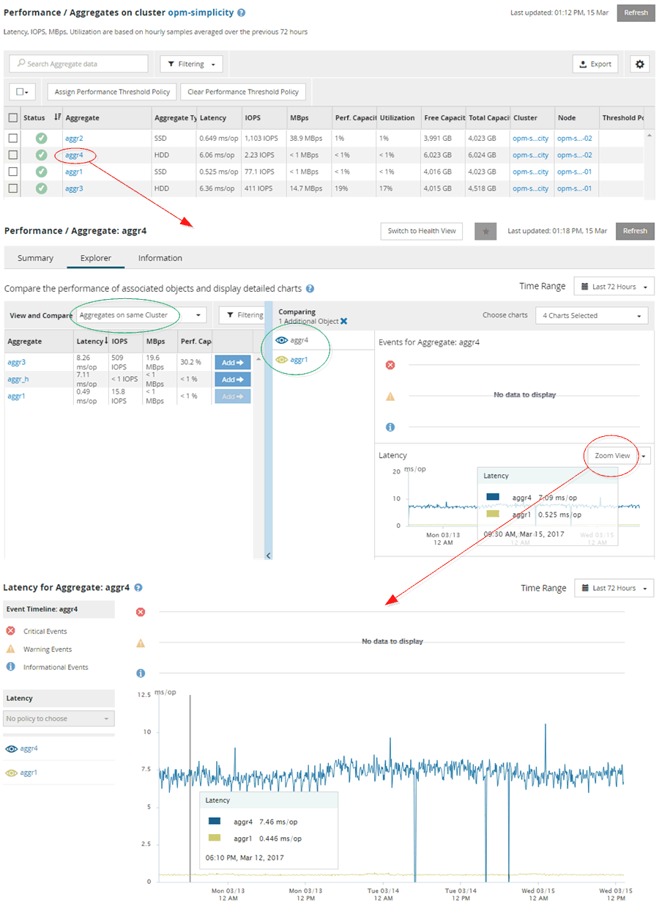

= 監控叢集效能導覽
:allow-uri-read: 
:icons: font
:imagesdir: ../media/

[role="lead"]
Unified Manager可讓您監控Unified Manager管理的所有叢集效能。監控叢集提供叢集與物件效能的總覽、並包含效能事件監控功能。您可以在高層級檢視效能和事件、也可以進一步調查叢集、物件效能和效能事件的任何詳細資料。

這是許多可能的叢集效能導覽路徑的其中一個範例：

. 在「儀表板/效能」頁面中、找出您要調查的叢集、然後按一下「*檢視叢集詳細資料*」以瀏覽至所選叢集的登陸頁面。
. 在「效能/叢集摘要」頁面中、找出您要調查的物件類型、然後按一下該物件類型以檢視物件詳細目錄頁面。
+
在此範例中、* Aggregate *會顯示「效能/集合體」目錄頁。

. 在「效能/集合體」頁面中、找出您要調查的集合體、然後按一下該集合體名稱以導覽至「效能/集合體總管」頁面。
. 或者、在「檢視與比較」功能表中選取其他物件以與此Aggregate進行比較、然後將其中一個物件新增至「比較」窗格。
+
這兩個物件的統計資料都會顯示在計數器圖表中以供比較。

. 在「檔案總管」頁面右側的「比較」窗格中、按一下其中一個計數器圖表中的「*縮放檢視*」、即可檢視該集合體效能歷程記錄的詳細資料。

