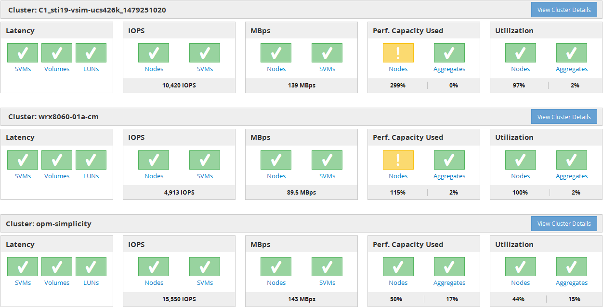

= 瞭解效能儀表板
:allow-uri-read: 
:icons: font
:imagesdir: ../media/

[role="lead"]
Unified Manager效能儀表板提供環境中所有受監控叢集效能狀態的高層級總覽。具有效能問題的叢集會依嚴重性在頁面頂端排序。儀表板上的資訊會在每個五分鐘的效能收集期間自動更新。

下圖顯示Unified Manager效能儀表板監控兩個叢集的範例：

代表儲存物件的狀態圖示可以是下列狀態、從最高嚴重性排序為最低嚴重性：

* 重大（image:../media/sev-critical-um60.png["事件嚴重性的圖示–嚴重"]）：已針對物件報告一或多個新的關鍵效能事件。
* 警告（image:../media/sev-warning-um60.png["事件嚴重性圖示–警告"]）：已針對物件報告一或多個新的警示效能事件。
* 正常（image:../media/sev-normal-um60.png["事件嚴重性圖示–正常"]）：未報告該物件的新效能事件。

[NOTE]
====
此色彩會指出物件是否存在新事件。不再使用的事件（稱為過時事件）不會影響圖示的色彩。

====

== 叢集效能計數器

每個叢集會顯示下列效能類別：

* 延遲
+
顯示叢集回應用戶端應用程式要求的速度、以毫秒為單位、每次作業。

* IOPS
+
顯示叢集的作業速度、每秒輸入/輸出作業數。

* Mbps
+
顯示叢集的資料傳輸量、以每秒MB為單位。

* 使用的效能容量
+
顯示是否有任何節點或集合體過度使用其可用的效能容量。

* 使用率
+
顯示是否過度使用任何節點或集合體上的資源。

若要分析叢集和儲存物件的效能、您可以執行下列其中一項動作：

* 您可以按一下「*檢視叢集詳細資料*」來顯示「叢集登陸」頁面、您可以在其中檢視所選叢集和儲存物件的詳細效能和事件資訊。
* 您可以按一下物件的紅色或黃色狀態圖示之一、以顯示該物件的「Inventory（資源清冊）」頁面、您可以在其中檢視儲存物件的詳細資料。
+
例如、按一下磁碟區圖示會顯示「效能/磁碟區」目錄頁面、其中會列出所選叢集中的所有磁碟區清單、從最差效能到最佳效能的順序進行排序。

