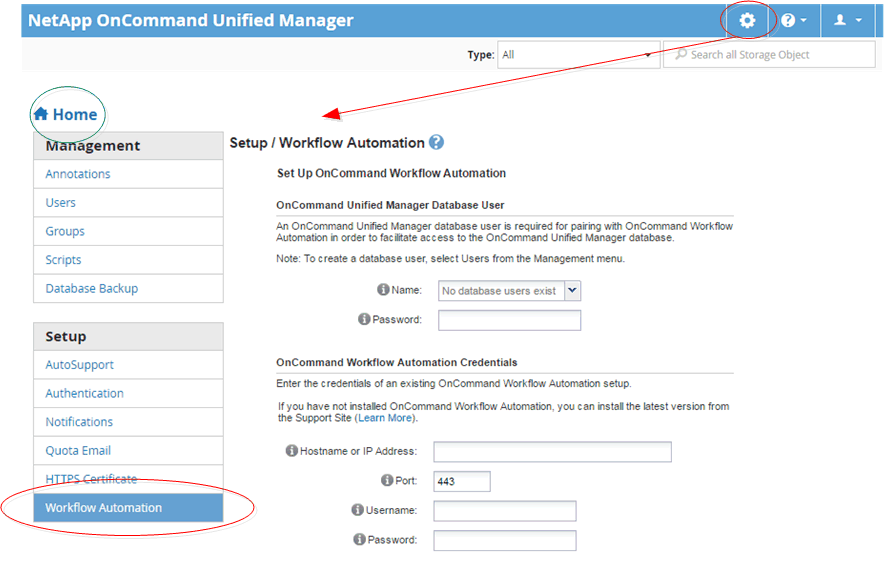

= Unified Manager管理導覽
:allow-uri-read: 
:icons: font
:imagesdir: ../media/

[role="lead"]
Unified Manager管理功能可讓您管理使用者和資料來源。您也可以完成設定工作、例如驗證、AutoSupport 功能驗證、電子郵件、HTTPS憑證、網路、和NTP伺服器。

這是許多可能的管理導覽路徑的其中一個範例。若要新增或移除與Workflow Automation伺服器的連線、請遵循下列導覽範例：

[NOTE]
====
按一下*首頁*圖示、即可返回Unified Manager主導覽頁面。

====