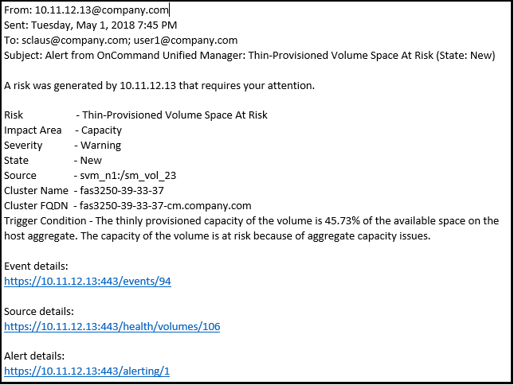

= 警示電子郵件中包含哪些資訊
:allow-uri-read: 
:icons: font
:imagesdir: ../media/

[role="lead"]
Unified Manager警示電子郵件會提供事件類型、事件嚴重性、違反導致事件的原則名稱、以及事件說明。電子郵件訊息也會提供每個事件的超連結、讓您在UI中檢視事件的詳細資料頁面。

警示電子郵件會傳送給所有訂閱接收警示的使用者。

如果效能計數器或容量值在收集期間有大幅變更、可能會同時觸發同一個臨界值原則的重大和警告事件。在這種情況下、您可能會收到一封警告事件電子郵件、另一封則是重大事件的電子郵件。這是因為Unified Manager可讓您個別訂閱、以接收警示、以因應警告和重大臨界值違規事件。

[NOTE]
====
升級至Unified Manager 7.2（或更新版本）之後、從舊版Unified Manager傳送的電子郵件所產生的事件和警示連結將不再運作、因為事件和警示URL有所變更。

====
警示電子郵件範例如下所示：

