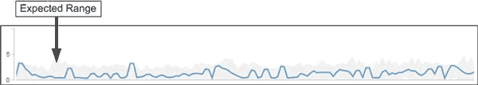

= 預期範圍如何用於效能分析
:allow-uri-read: 
:icons: font
:imagesdir: ../media/

[role="lead"]
Unified Manager會使用預期範圍來代表監控工作負載的典型I/O延遲（回應時間）和IOPS（作業）活動。當工作負載的實際延遲超過預期範圍的上限時、系統會發出警示、這會觸發效能事件、以便您分析效能問題、並採取修正行動來解決問題。

預期範圍會設定工作負載的效能基準。隨著時間推移、Unified Manager會從過去的效能測量結果中學習、以預測工作負載的預期效能和活動層級。預期範圍的上限會建立效能臨界值。Unified Manager使用基準來判斷實際延遲或作業何時高於或低於臨界值、或超出預期範圍。實際值與預期值之間的比較、可為工作負載建立效能設定檔。

當工作負載的實際延遲因叢集元件爭用而超過效能臨界值時、延遲會很高、而且工作負載的執行速度會比預期的慢。共享相同叢集元件的其他工作負載效能也可能會比預期的慢。

Unified Manager會分析臨界值跨越事件、並判斷活動是否為效能事件。如果高工作負載活動長期保持一致（例如數小時）、Unified Manager會將活動視為正常活動、並動態調整預期範圍以形成新的效能臨界值。

某些工作負載的活動量可能會持續偏低、因為預期的作業範圍或延遲時間不會隨著時間而發生高變動。為了將事件警示數量降至最低、在分析效能事件期間、Unified Manager只會觸發低活動磁碟區的事件、其作業和延遲遠高於預期。

在此範例中、磁碟區的延遲範圍為每次作業0毫秒（毫秒/秒）、最低為5毫秒/秒（最高）。如果實際延遲（藍色）突然增加至每次10毫秒、因為網路流量間歇性激增或叢集元件發生爭用、則會超出預期範圍、並超過效能臨界值。

當網路流量減少、或叢集元件不再發生爭用時、延遲會在預期範圍內傳回。如果延遲時間長達10毫秒以上/作業時間、您可能需要採取修正行動來解決此事件。
