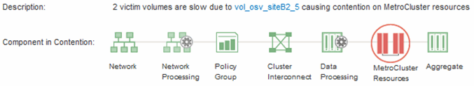

= 分析MetroCluster 叢集上的動態效能事件、使其採用VMware的組態
:allow-uri-read: 
:icons: font
:imagesdir: ../media/

[role="lead"]
您可以使用Unified Manager來分析MetroCluster 叢集、以進行偵測到效能事件的VMware組態。您可以識別叢集名稱、事件偵測時間、以及相關的_bully_和_als_工作負載。

== 開始之前

* 您必須OnCommand 具備「操作員」、「資訊管理員」或「儲存管理員」角色。
* 針對這個組態、必須有新的、已確認的或過時的效能事件MetroCluster 。
* 在不支援的組態中、兩個叢集MetroCluster 都必須由Unified Manager的同一個執行個體監控。

== 步驟

. 顯示「*事件詳細資料*」頁面以檢視事件的相關資訊。
. 檢閱事件說明、查看所涉及的工作負載名稱、以及涉及的工作負載數量。
+
在此範例中MetroCluster 、「不支援資源」圖示為紅色、表示MetroCluster 該資源正在爭用。您可以將游標放在圖示上、以顯示圖示的說明。在事件ID頁面頂端、叢集名稱會識別偵測到事件的叢集名稱。

+

. 請記下叢集名稱和事件偵測時間、以便用來分析合作夥伴叢集上的效能事件。
. 在圖表中、檢閱_受害者 工作負載、確認其回應時間高於效能臨界值。
+
在此範例中、受害者工作負載會顯示在暫留文字中。延遲圖表會針對所涉及的受害者工作負載、以高層級顯示一致的延遲模式。即使受害者工作負載的異常延遲觸發了事件、一致的延遲模式可能表示工作負載在預期範圍內執行、但I/O的尖峰會增加延遲並觸發事件。

+
image::../media/opm-mcc-incident-victim-workloads-png.gif[效能事件中的受害者工作負載MetroCluster 、用於進行不實的組態設定]

+
如果您最近在存取這些Volume工作負載的用戶端上安裝應用程式、而該應用程式傳送大量I/O給他們、您可能會預期延遲會增加。如果工作負載的延遲在預期範圍內傳回、則事件狀態會變更為「已過時」、並保持此狀態超過30分鐘、您可能會忽略此事件。如果事件仍在進行中、而且仍處於新狀態、您可以進一步調查、以判斷是否有其他問題導致此事件。

. 在「工作負載處理量」圖表中、選取*「Bull Workload*」以顯示效能不高的工作負載。
+
若有高效能的工作負載、則表示事件可能是由本機叢集上的一或多個工作負載過度使用MetroCluster 此等資源所造成。高效能的工作負載在寫入處理量（Mbps）方面有很大的差異。

+
此圖表以高層級顯示工作負載的寫入處理量（Mbps）模式。您可以檢閱寫入Mbps模式來識別異常處理量、這可能表示工作負載過度使用MetroCluster 此功能的資源。

+
如果事件不涉及任何高效能工作負載、則事件可能是由叢集之間連結的健全狀況問題或合作夥伴叢集的效能問題所造成。您可以使用Unified Manager來檢查MetroCluster 兩組叢集的健全狀況、以進行功能性設定。您也可以使用Unified Manager來檢查及分析合作夥伴叢集上的效能事件。

