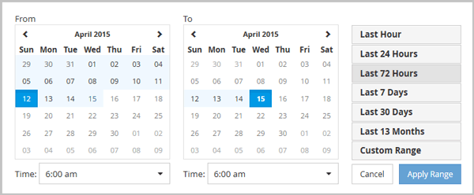

= 指定自訂時間範圍
:allow-uri-read: 
:icons: font
:imagesdir: ../media/

[role="lead"]
「效能總管」頁面可讓您指定效能資料的日期和時間範圍。指定自訂時間範圍比使用預先定義的時間範圍來調整叢集物件資料更靈活。

== 關於這項工作

您可以選取一個小時到390天之間的時間範圍。13個月等於390天、因為每個月計為30天。指定日期與時間範圍可提供更多詳細資料、並可讓您放大特定效能事件或一系列事件。指定時間範圍也有助於疑難排解潛在的效能問題、因為指定日期和時間範圍會更詳細地顯示效能事件的相關資料。使用*時間範圍*控制項來選取預先定義的日期和時間範圍、或指定您自己的自訂日期和時間範圍、最長可達390天。預先定義時間範圍的按鈕從*最後一小時*到*過去13個月*不等。

選取*最後13個月*選項或指定超過30天的自訂日期範圍、會顯示對話方塊、提醒您、使用每小時平均值而非5分鐘資料輪詢、記錄顯示超過30天的效能資料。因此、可能會造成時間軸視覺精細度的損失。如果您按一下對話方塊中的*不要再顯示*選項、當您選取*過去13個月*選項或指定超過30天的自訂日期範圍時、就不會出現此訊息。如果時間範圍包含的時間/日期超過今天的30天、則摘要資料也會套用在較短的時間範圍內。

選取時間範圍（自訂或預先定義）時、30天或更少的時間範圍是根據5分鐘的時間間隔資料樣本而定。時間範圍大於30天是以一小時的時間間隔資料範例為基礎。

. 按一下「*時間範圍*」下拉式方塊、即會顯示「時間範圍」面板。
. 若要選取預先定義的時間範圍、請按一下「*時間範圍*」面板右側的*最後...*按鈕之一。選取預先定義的時間範圍時、最多可提供13個月的資料。您選取的預先定義時間範圍按鈕會反白顯示、而對應的日期和時間會顯示在行事曆和時間選取器中。
. 若要選取自訂日期範圍、請按一下左側*寄件者*行事曆中的開始日期。按一下「*」或「*」、即可在行事曆中向前或向後瀏覽。若要指定結束日期、請按一下右側*目標*行事曆中的日期。請注意、除非您指定不同的結束日期、否則預設的結束日期為今天。時間範圍面板右側的*自訂範圍*按鈕會反白顯示、表示您已選取自訂日期範圍。
. 若要選取自訂時間範圍、請按一下*來源*行事曆下方的*時間*控制項、然後選取開始時間。若要指定結束時間、請按一下右側*目標*行事曆下方的*時間*控制項、然後選取結束時間。時間範圍面板右側的*自訂範圍*按鈕會反白顯示、表示您已選取自訂時間範圍。
. 您也可以在選取預先定義的日期範圍時、指定開始和結束時間。選取先前所述的預先定義日期範圍、然後選取先前所述的開始和結束時間。選定的日期會在行事曆中反白顯示、您指定的開始和結束時間會顯示在*時間*控制項中、而*自訂範圍*按鈕則會反白顯示。
. 選取日期與時間範圍後、按一下*套用範圍*。該時間範圍的效能統計資料會顯示在圖表和事件時間表中。

